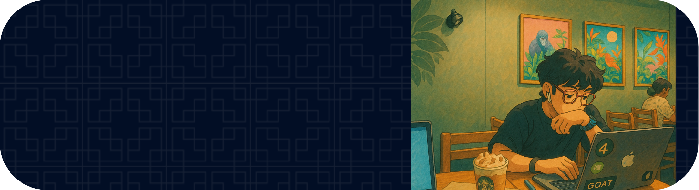

# Hello World!, I'm Sarvagya, an Indian AI Engineer :
Currently pursuing an MSc in Artificial Intelligence at Queen Mary University of London, specializing in Machine Learning and Deep Learning. I am passionate about building impactful AI solutions and have hands-on experience across computer vision, natural language processing, and applied data science.
As of now, I am working on my Final project on Multimodal Emotion Recognition from text, audio & video inputs for MSc in Artificial Intelligence 

## 🌐 Socials:
   

# 💻 Tech Stack:
                                 
# 📊 GitHub Stats:
 
 

<picture>
  <source media="(prefers-color-scheme: dark)" srcset="https://raw.githubusercontent.com/SarvagyaRastogi7/SarvagyaRastogi7/output/pacman-contribution-graph-dark.svg">
  <source media="(prefers-color-scheme: light)" srcset="https://raw.githubusercontent.com/SarvagyaRastogi7/SarvagyaRastogi7/output/pacman-contribution-graph.svg">
  
</picture>

###
###
<picture>
  <source media="(prefers-color-scheme: dark)" srcset="https://raw.githubusercontent.com/SarvagyaRastogi7/SarvagyaRastogi7/output/github-snake-dark.svg" />
  <source media="(prefers-color-scheme: light)" srcset="https://raw.githubusercontent.com/SarvagyaRastogi7/SarvagyaRastogi7/output/github-snake.svg" />
  
</picture>
